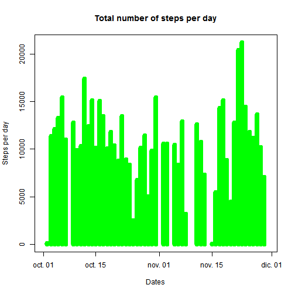
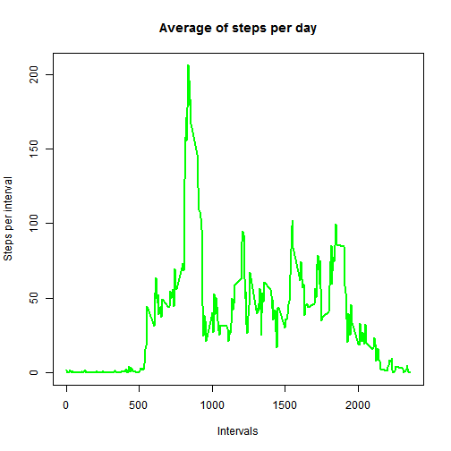
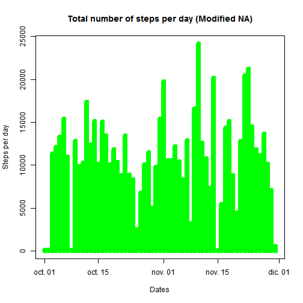
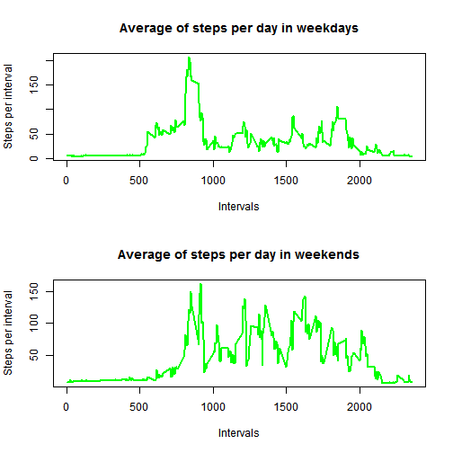

#Loading and preprocessing the data.

##1.Load the data from the file.

```r
data <- read.csv(".\\data\\activity.csv")
```

##2.Modify the date field from factor to date.

```r
data$date <- as.Date(data$date)
```

#What is mean total number of steps taken per day?

##1.Calculate the total number of steps taken per day.

```r
totalsteps <- aggregate(data$steps, by=list(data$date), FUN=sum)
colnames(totalsteps) <- c("date","steps")
```

##2.Histogram plot with steps per day.

```r
plot(totalsteps$date, totalsteps$steps, type="h", col="green", lwd=8, ylab="Steps per day", xlab="Dates", main="Total number of steps per day")
```



##3.Mean and median steps per day.

```r
paste("Mean steps per day: ", mean(totalsteps$steps, na.rm=TRUE))
```

```
## [1] "Mean steps per day:  10766.1886792453"
```

```r
paste("Median steps per day: ", median(totalsteps$steps, na.rm=TRUE))
```

```
## [1] "Median steps per day:  10765"
```

#What is the average daily activity pattern?

##1.Calculate the average steps 5 minute-interval and plot.

```r
avgsteps <- aggregate(data$steps,by=list(data$interval), FUN=mean, na.rm=TRUE)
colnames(avgsteps) <- c("interval","steps")
plot(avgsteps$interval, avgsteps$steps, type="l", col="green", lwd=2, ylab="Steps per interval", xlab="Intervals", main="Average of steps per day")
```



##2.Interval with max number of steps on average.

```r
paste("Max interval: ",avgsteps$interval[which(avgsteps$steps == max(avgsteps$steps))]," with value of: ",max(avgsteps$steps))
```

```
## [1] "Max interval:  835  with value of:  206.169811320755"
```

#Imputing missing values

##1.Calculate the total NA values.

```r
paste("Total NA values: ",sum(is.na(data)))
```

```
## [1] "Total NA values:  2304"
```

##2.Devise a strategy for filling in all of the missing values in the dataset.
Replace NA value with the mean value of the interval where it was found.

##3.New dataset with NA values filled with the strategy.

```r
dataNoNA <- data
stepsMerged = merge(avgsteps,dataNoNA, by="interval", suffixes=c(".NoNA", ".NA"))
indexNA <- which(is.na(data$steps))
dataNoNA[indexNA,"steps"] = stepsMerged[indexNA,"steps.NoNA"]
```

##4.Histogram and calculate mean and median.

```r
stepsNoNA <- aggregate(dataNoNA$steps,by=list(data$date), FUN=sum)
colnames(stepsNoNA) <- c("date","steps")
plot(stepsNoNA$date, stepsNoNA$steps, type="h", col="green", lwd=8, ylab="Steps per day", xlab="Dates", main="Total number of steps per day (Modified NA)")
```



```r
paste("Original data -> Mean steps per day: ", mean(totalsteps$steps, na.rm=TRUE))
```

```
## [1] "Original data -> Mean steps per day:  10766.1886792453"
```

```r
paste("New data -> Mean steps per day: ", mean(stepsNoNA$steps))
```

```
## [1] "New data -> Mean steps per day:  10889.7992576554"
```

```r
paste("Original data -> Median steps per day: ", median(totalsteps$steps, na.rm=TRUE))
```

```
## [1] "Original data -> Median steps per day:  10765"
```

```r
paste("New data -> Median steps per day: ", median(stepsNoNA$steps))
```

```
## [1] "New data -> Median steps per day:  11015"
```

#Are there differences in activity patterns between weekdays and weekends?

##1.New factor variable 'weekend' and 'weekday'.
Get the language of the system and set it to English.

```r
lc <- Sys.getlocale("LC_TIME")
Sys.setlocale("LC_TIME","English")
```

```
## [1] "English_United States.1252"
```

```r
for (i in 1:nrow(dataNoNA)) {
	day <- weekdays(dataNoNA$date[i])
	if (day == "Saturday" | day == "Sunday") 
		dataNoNA$dayOfWeek[i] = "weekend"
	else
		dataNoNA$dayOfWeek[i] = "weekday"
}
```

Come back to the original language of the system.

```r
Sys.setlocale("LC_TIME",lc)
```

```
## [1] "Spanish_Spain.1252"
```

##2.Interval with max number of steps on average for weekdays and weekends 

```r
wd <- subset(dataNoNA,dayOfWeek == "weekday")
we <- subset(dataNoNA,dayOfWeek == "weekend")

par(mfrow=c(2,1)) 

wdsteps <- aggregate(wd$steps,by=list(wd$interval), FUN=mean, na.rm=TRUE)
colnames(wdsteps) <- c("interval","steps")
plot(wdsteps$interval, wdsteps$steps, type="l", col="green", lwd=2, ylab="Steps per interval", xlab="Intervals", main="Average of steps per day in weekdays")

westeps <- aggregate(we$steps,by=list(we$interval), FUN=mean, na.rm=TRUE)
colnames(westeps) <- c("interval","steps")
plot(westeps$interval, westeps$steps, type="l", col="green", lwd=2, ylab="Steps per interval", xlab="Intervals", main="Average of steps per day in weekends")
```




